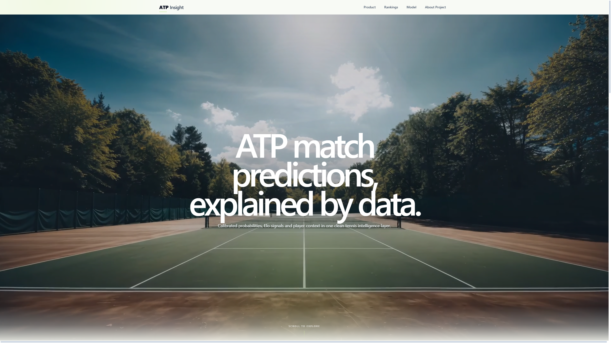

# ATP Insight

**End-to-end ATP tennis analytics: from historical match data to calibrated probabilities and an interactive data product.**

[**Explore the live application →**](https://atpinsight-two.vercel.app/)

## Project overview

ATP Insight is a personal portfolio project that brings data engineering, tennis analytics, machine learning and product design into one coherent experience. It transforms public historical match records into rankings, player profiles, tournament context and probabilistic previews for ATP men's singles.

The project is built around a practical question: how can a tennis prediction communicate more than a single number? Rankings are useful but incomplete; player strength evolves, changes by surface and depends on the quality and recency of the evidence. ATP Insight combines several perspectives and makes the resulting signals inspectable in the product.

| Dimension | What ATP Insight contributes |
|---|---|
| Data engineering | Acquisition, normalization, chronological processing and quality controls |
| Tennis analytics | General Elo, surface Elo, rankings, form, serve indicators and head-to-head context |
| Machine learning | Candidate comparison, probability calibration and leakage-aware offline evaluation |
| Product development | Responsive exploration across matches, players, rankings, tournaments and model evidence |

## Explore the product

### Match predictions

Upcoming matches pair model probabilities with rankings, Elo context and the signals behind the forecast. The detail view is designed to support interpretation rather than present certainty.

### Player profiles and comparison

Player pages bring together ranking position, Elo by surface, recent results and historical context. Comparison views make differences between two players easy to scan.

### Tournament context

Tournament pages connect event information, match status, results and draw context so predictions remain grounded in the competition around them.

### Model transparency

The model area documents candidate performance, the ranking baseline, calibration and feature contribution. Metrics are presented with their evaluation context and known caveats.

## Product capabilities

| Area | Experience |
|---|---|
| Home | Current tournaments, featured matches and entry points into the analytical product |
| Predictions | Upcoming match probabilities with confidence and model-signal context |
| Players | Searchable directory, player profiles and performance history |
| Compare | Side-by-side ranking, Elo, surface and recent-form comparison |
| Rankings | ATP standings plus general and surface-specific Elo views |
| Tournaments | Current and historical events, results and draw context |
| Model | Candidate comparison, baseline, calibration and feature-importance views |

## From records to product

~~~mermaid
flowchart LR
    A["Public ATP data"] --> B["Normalize and validate"]
    B --> C["Chronological match history"]
    C --> D["Pre-match features"]
    D --> E["Candidate models"]
    E --> F["Calibration and evaluation"]
    F --> G["Curated product data"]
    G --> H["ATP Insight web application"]
~~~

The public application consumes a compact, curated presentation layer. Large datasets, credentials, generated model artifacts and operational source systems are intentionally excluded from this portfolio repository.

## Analytical methodology

### Data and quality

Historical tournament, player, ranking and match records are standardized before analysis. The workflow resolves identifiers and names, aligns dates and surfaces, validates required fields and preserves chronological order. Coverage and missingness are treated as part of the analytical evidence, not hidden implementation details.

### Tennis-specific signals

- ATP ranking position and ranking points
- General Elo and surface-specific Elo
- Recent results and historical match volume
- Head-to-head records available before the match
- Rolling serve and return indicators when coverage permits
- Tournament surface and matchup context

Elo provides a dynamic view of strength: ratings change after each result, with larger movements when the outcome is more surprising. Surface-specific ratings add context for hard, clay and grass courts while acknowledging that sparse histories create greater uncertainty.

### Modeling and evaluation

The target is the winner of an ATP men's singles match. Candidate classifiers are compared on the same later-season holdout, and probability quality is considered alongside classification accuracy. The selected public result uses XGBoost; a sigmoid-calibrated XGBoost candidate is retained as a useful comparison.

| Model | Accuracy | ROC AUC | Brier score | Log loss | ECE |
|---|---:|---:|---:|---:|---:|
| Selected XGBoost | 84.57% | 0.9209 | 0.1117 | 0.3588 | 0.0198 |
| Sigmoid-calibrated XGBoost | 83.92% | 0.9180 | 0.1135 | 0.3678 | 0.0186 |
| Higher-ranked-player baseline | 62.84% | 0.6597 | — | — | — |

These figures come from an offline 2026 holdout after training on 1991–2025 history. They are not production guarantees. Candidate comparison and final reporting currently share the same holdout, and some legacy-compatible Elo signals still require stricter pre-match verification. The results are portfolio evidence, not a definitive unbiased estimate.

## Technology

| Layer | Technologies |
|---|---|
| Data and analysis | Python, pandas, NumPy |
| Modeling | scikit-learn, XGBoost and TensorFlow experimentation |
| Product | Next.js, React, TypeScript, Tailwind CSS and accessible UI primitives |
| Delivery | Static curated data, responsive visualization, SEO and Vercel |

## Documentation

### Product and architecture

- [Project overview](docs/project-overview.md)
- [Architecture](docs/architecture.md)
- [Web application](docs/web-application.md)
- [Data pipeline](docs/data-pipeline.md)

### Analytics and evaluation

- [Feature engineering](docs/feature-engineering.md)
- [Rating system](docs/rating-system.md)
- [Modeling](docs/modeling.md)
- [Evaluation](docs/evaluation.md)
- [Data quality](docs/data-quality.md)

### Scope and stewardship

- [Limitations and responsible use](docs/limitations.md)
- [Future improvements](docs/future-improvements.md)
- [Asset attribution](docs/asset-attribution.md)

## Limitations and responsible use

Coverage varies across seasons, players, surfaces and match-stat fields. New or lower-ranked players have less historical evidence; incomplete serve statistics reduce some rolling features; and rankings or ratings cannot capture injuries, fatigue, travel, withdrawals or late lineup changes. Model quality can also shift as the tour evolves.

ATP Insight is an experimental analytics and portfolio project. Its probabilities are not betting or financial advice, and future results are not guaranteed. Read the full [limitations and responsible-use notes](docs/limitations.md).

## Roadmap

Priorities include a locked final test set, fully pre-match Elo validation, uncertainty intervals, stronger monitoring, richer tournament analytics and broader automated accessibility and performance checks. See the [technical roadmap](docs/future-improvements.md).

## Repository scope

This public repository presents the production web experience, approved web-ready data and portfolio documentation. Private data acquisition, training systems, credentials, full datasets and generated model artifacts are not published. No open-source license is granted by this repository.
