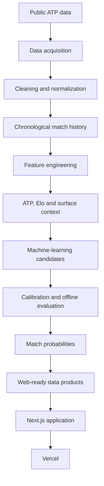

# ATP Insight

ATP Insight is a personal portfolio project that applies data engineering, tennis analytics, machine learning and web product development to professional men's tennis.

[**Open the live application →**](https://atpinsight-two.vercel.app/)

## Overview

Professional tennis predictions require more than a current ranking. Player strength changes over time, varies by surface and depends on the quality and recency of the available evidence. ATP Insight turns public historical tennis data into an analytical product that combines rankings, Elo ratings, recent form, matchup context and probabilistic model outputs.

The project covers the full path from raw records to a deployed product. The internal data and machine-learning implementation is intentionally private; this repository contains the production web application, approved web-ready data products and portfolio documentation.

## What the project demonstrates

- Data acquisition, normalization and quality validation
- Temporal feature engineering for sequential sports data
- General and surface-specific Elo rating systems
- Head-to-head, ranking, form and serve-performance context
- Classification, probability calibration and model comparison
- Leakage-aware evaluation and explicit uncertainty reporting
- Web-ready analytical datasets and data contracts
- Responsive data visualization with Next.js, React and TypeScript
- SEO, security headers, privacy-aware product design and Vercel deployment

## Product capabilities

| Area | Experience |
|---|---|
| Predictions | Upcoming match probabilities, confidence context and model signals |
| Players | Searchable player directory and individual player profiles |
| Compare | Side-by-side comparison of rankings, Elo and surface performance |
| Rankings | ATP rankings plus general and surface-specific Elo rankings |
| Tournaments | Current and historical tournament views, results and draw context |
| Match detail | Player comparison, probabilities, ranking context, Elo and head-to-head signals |
| Model performance | Candidate comparison, ranking baseline, confusion matrix and calibration views |
| Feature importance | Relative contribution of the current model's input signals |

## Technology stack

**Data and machine learning:** Python, pandas, NumPy, scikit-learn, XGBoost and TensorFlow experimentation.

**Product:** Next.js, React, TypeScript, Tailwind CSS, Radix UI primitives, Motion and Vercel.

## Architecture

The browser receives only static, curated product data. Scraping, training, model artifacts and private operational tooling are not part of the public repository.

## Modeling

The prediction target is the winner of an ATP men's singles match. Inputs compare the two players using ranking and points context, general and surface Elo, historical volume, head-to-head records, recent results and rolling serve-performance indicators. Candidate models are compared under a later-season holdout, with probability quality assessed alongside classification performance.

The current public result uses XGBoost. A sigmoid-calibrated XGBoost candidate is shown for comparison. See [Modeling](docs/modeling.md) for methodology and [Evaluation](docs/evaluation.md) for interpretation.

## Current offline evaluation

| Model | Accuracy | ROC AUC | Brier score | Log loss | ECE |
|---|---:|---:|---:|---:|---:|
| Selected XGBoost | 84.57% | 0.9209 | 0.1117 | 0.3588 | 0.0198 |
| Sigmoid-calibrated XGBoost | 83.92% | 0.9180 | 0.1135 | 0.3678 | 0.0186 |
| Higher-ranked-player baseline | 62.84% | 0.6597 | — | — | — |

These figures come from an offline 2026 holdout after training on 1991–2025 history. They are not production guarantees. Candidate comparison and final reporting currently share the same holdout, and the operational legacy-compatible feature set includes Elo signals that still require stricter pre-match verification. The results should therefore be treated as portfolio evidence, not as a definitive unbiased estimate.

## Documentation

- [Project overview](docs/project-overview.md)
- [Architecture](docs/architecture.md)
- [Data pipeline](docs/data-pipeline.md)
- [Feature engineering](docs/feature-engineering.md)
- [Rating system](docs/rating-system.md)
- [Modeling](docs/modeling.md)
- [Evaluation](docs/evaluation.md)
- [Data quality](docs/data-quality.md)
- [Web application](docs/web-application.md)
- [Limitations](docs/limitations.md)
- [Future improvements](docs/future-improvements.md)
- [Asset attribution](docs/asset-attribution.md)

## Limitations

Coverage varies across seasons, players, surfaces and match-stat fields. New or lower-ranked players have less historical evidence; incomplete serve statistics reduce some rolling features; and rankings or ratings cannot capture injuries, fatigue, travel, withdrawals or late lineup changes. Model quality can also shift when the tour changes over time.

Read the full [limitations and responsible-use notes](docs/limitations.md).

## Future work

Priorities include a locked final test set, fully pre-match Elo validation, uncertainty intervals, stronger monitoring, richer tournament analytics and more automated accessibility and performance checks. See the [technical roadmap](docs/future-improvements.md).

## Disclaimer

ATP Insight is an experimental analytics and portfolio project. Its probabilities are not betting or financial advice, and future results are not guaranteed.

## Source availability

The frontend is visible for portfolio review. The private data pipeline, scraping, training code, models and operational automation are deliberately excluded. No open-source license is granted by this repository.
