# Architecture

## System view

ATP Insight separates analytical production from public delivery. Private services prepare validated, versioned outputs; the public Next.js application reads those outputs as static product data. This keeps deployment simple and prevents scraping credentials, model binaries and pipeline implementation from reaching the browser or public source history.

```mermaid
flowchart LR
    subgraph Private["Private analytical system"]
        A["Public tennis sources"] --> B["Acquisition"]
        B --> C["Normalization and validation"]
        C --> D["Chronological match store"]
        D --> E["Ratings and features"]
        E --> F["Training and calibration"]
        F --> G["Evaluation and prediction"]
        G --> H["Curated publication layer"]
    end

    subgraph Public["Public product"]
        H --> I["Versioned static datasets"]
        I --> J["Next.js server and static rendering"]
        J --> K["React user experience"]
        K --> L["Vercel delivery"]
    end
```

## Analytical layers

### Acquisition

Tournament, player, ranking and match records arrive from public tennis sources. Collection is rate-conscious and isolated from the public application.

### Standardization

The pipeline reconciles identifiers, names, dates, round labels and surface values. Match records are placed into a deterministic chronological order before any sequential feature is calculated.

### Feature and rating state

Stateful calculations maintain general Elo, surface Elo, player histories, head-to-head records and rolling windows. For a valid predictive feature, state is read before the current match is applied.

### Modeling

Candidate classifiers learn a probability for the player represented in the first orientation. Player orientation is balanced during dataset construction so the target is not tied to winner/loser source ordering.

### Publication

Only compact data products needed by the interface are published. They cover predictions, rankings, players, tournaments, model diagnostics and selected match statistics. Raw data, model objects and training metadata remain private.

## Web architecture

The web application uses the Next.js App Router. Server-rendered routes load static local datasets, while client components provide filtering, sorting, responsive navigation and interactive charts. Dynamic player, tournament and match pages resolve against the same published data contracts; there is no public database connection or model inference endpoint.

Security headers restrict framing, cross-origin connections and optional browser capabilities. Production source maps are disabled. Legal and privacy pages are intentionally excluded from search indexing while core product routes receive canonical metadata, Open Graph assets, robots directives and a focused sitemap.

## Deployment boundary

Vercel builds the `web` application from the public repository. The build requires frontend source, configuration, static assets and the approved web-ready datasets. It does not require the private Python package, raw data, training code, model files or refresh automation.
