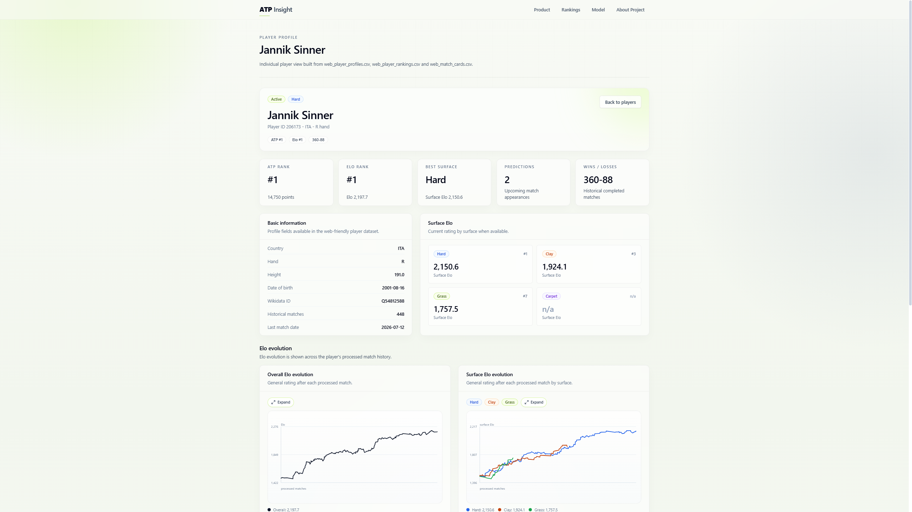

# Project overview

## Purpose

ATP Insight explores a practical question: how can historical tennis data be transformed into probabilities and analytical context that are understandable to a general audience?

The result is an end-to-end personal portfolio project covering data acquisition, normalization, temporal analysis, rating systems, supervised learning, evaluation and a deployed web product. The emphasis is not only on predictive performance, but also on data quality, interpretability, responsible communication and product delivery.

## Problem framing

ATP rankings are valuable, but they are not a complete estimate of match strength. They aggregate results over a ranking window and do not directly express surface specialization, recent trajectory, matchup history or probability. ATP Insight combines those perspectives while preserving the chronological nature of tennis data.

The core prediction task is binary: estimate the probability that either player wins a scheduled ATP men's singles match. Every feature should represent information available before that match. This constraint shapes the data model, feature calculations and evaluation strategy.

## Product outcome

The public application presents:

- upcoming match probabilities;
- player profiles and recent form;
- ATP, Elo and surface-Elo rankings;
- player comparison views;
- tournament calendars, results and draw context;
- match-level explanations;
- model metrics, baseline comparisons and feature importance.

## Scope of this repository

This public release contains the production web application, curated web-ready datasets and explanatory documentation. The acquisition, processing, feature-generation, model-training and operational automation layers remain private. The documentation describes the engineering and analytical decisions without exposing a reproducible copy of the internal implementation.

## Success criteria

The project is successful when it can:

1. Maintain consistent identities for players, tournaments and matches.
2. Build chronological signals without intentionally using future match outcomes.
3. Compare a learned probability model with an understandable ranking baseline.
4. Publish model context and limitations alongside predictions.
5. Deliver a responsive, accessible and indexable web experience from static data products.

## Responsible interpretation

The application is analytical, not advisory. A well-scored model can still be wrong on any individual match. Injuries, fatigue, withdrawals, travel and last-minute conditions are not reliably represented. Published probabilities describe model uncertainty from available data; they do not guarantee outcomes.
