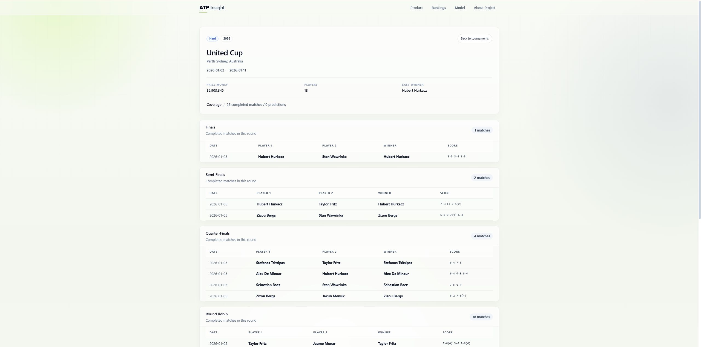
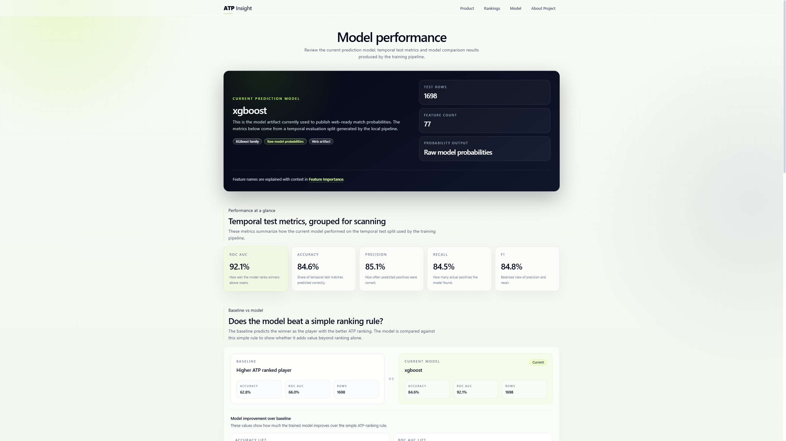

# Web application

## Product architecture

ATP Insight is built with Next.js, React and TypeScript. The application uses the App Router and a combination of server-rendered pages and focused client components. Tailwind CSS provides the visual system, Radix primitives support accessible navigation behavior and Motion is used for restrained interface transitions.

The public site does not call a private model endpoint. It reads curated static datasets prepared before deployment, which makes pages deterministic and keeps credentials, raw data and model artifacts outside the browser.

## Main experiences

### Home

The landing page highlights the current analytical context, featured predictions, rankings and active tournaments.

### Predictions and match detail

Prediction cards show both player probabilities, surface, round and confidence context. Detail pages add ranking, Elo, head-to-head and explanation signals while emphasizing that probability is not certainty.

### Players and compare

The player directory supports discovery and filtering. Player profiles combine official rank, Elo, surface performance, recent matches and rating history. The compare view aligns the same evidence for two players.

### Rankings

Separate experiences present official ATP rankings and model-derived Elo rankings. Surface controls expose specialization and rating movement.

### Tournaments

Tournament pages group current and historical editions, provide event context, show completed and upcoming matches and render draw relationships where the available data is sufficient.

### Model transparency

The model area presents the selected candidate, classification metrics, ranking baseline, confusion matrix and calibration bins. Feature importance is shown as model usage rather than causal explanation.

## Data loading

Server-side loaders parse local, versioned data products. Large ranking and tournament histories use indexes and partitions to keep route payloads focused. Dynamic route identifiers are resolved against published records rather than used to construct database queries or arbitrary filesystem paths.

## Responsive behavior

Layouts adapt from mobile to wide desktop screens. Tables expose horizontal overflow where necessary, navigation offers keyboard-accessible menus, filters collapse into mobile panels and cards preserve readable hierarchy at smaller widths.

## Accessibility

The interface uses semantic headings, descriptive links, labelled controls, visible focus states and text alternatives for social metadata. Charts and ranking movement indicators retain textual values so color is not the only carrier of meaning.

Accessibility is an ongoing engineering constraint rather than a completed certification. Automated and manual audits remain part of the roadmap.

## SEO

Core pages provide canonical metadata, page-specific titles and descriptions, Open Graph and Twitter assets, robots directives and a deterministic sitemap. Representative player and tournament URLs are included without flooding the index with every transient prediction or match URL.

## Security and privacy

The production configuration applies Content Security Policy, HSTS, anti-framing, MIME-sniffing protection, referrer policy and restricted browser-permission headers. Production source maps are disabled.

The current product is essential-only: it does not intentionally include analytics trackers, advertising tags or nonessential cookies. A local preference stores only whether the privacy notice has been dismissed.

## Deployment

The same GitHub repository and `main` branch are intended to continue driving the existing Vercel project. The public build requires only the web application, its approved data products and static assets. No change to the Vercel project, domain or environment configuration is required by the repository-history reset.
